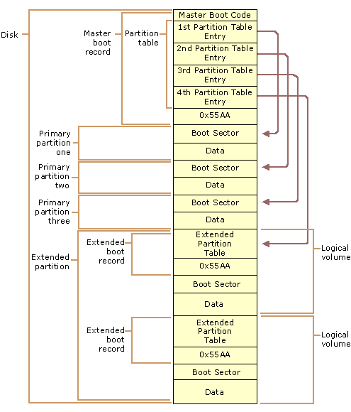

# Kernel Development

## Basic theory

The CPU reads code from BIOS's ROM and executes it in real time

The BIOS can then load itself into RAM and continue execution from there.

BIOS provides generic and standard routines, containing routines that assist the bootloader to boot our Kernel and initialize essential hardware.

BIOS is 16-bit code

### Looking for the Boot signature and starting the Bootloader

Read BIOS from ROM and execute in real time directly
The BIOS loads the bootloader into address 0x7C00
The bootloader then loads the kernel

Bootloader executes in real mode: 16 bit code and can access upto 1 MB Memory

It switches the processor to 32-bit Protected mode and loads the Kernel into Memory. The Kernel at this stage can access upto 4 GB Memory.

The basic order of operations that happens while a BIOS is trying to find something to boot (the bootloader) is:

1. Load first sector (512 bytes) of the device you're trying to boot from (HDD, SSD, Floppy Disk, Optical Disc, etc) into memory. The entire bootloader sequence is encapsulated in 512 Bytes.
2. Check if the 511th and 512th bytes are 0x55 and 0xAA, respectively.
    - If not, go back to step 1 and try the next device, or give up if there aren't any more.
    - If yes, start executing code at the beginning of this sector, thus passing control to (hopefully) a boot loader/manager.



The BIOS loads the bootloader into RAM at 0x7C00

The BIOS then executes JUMP 0x7C00

## Environment setup and Hello World

```bash
sudo apt install nasm
sudo apt install qemu-system-x86
nasm -f bin ./boot.asm -o ./boot.bin
ndisasm ./boot.bin
qemu-system-x86_64 -hda ./boot.bin
```

## **BPB (BIOS Parameter Block) in the Boot Sector**

[FAT](https://wiki.osdev.org/FAT#BPB_.28BIOS_Parameter_Block.29)

## Creating Bootable USB

```bash
sudo dd if=./boot.bin of=/dev/sdb
```

## Interrupts

Interrupts are special subroutines that do not require explicit memory address to invoke them, they are called using respective interrupt number.

Invoking an interrupt:
Save state to stack > Call interrupt routine > Load saved state from stack and continue execution

### Interrupt Vector Table

Start at 0x00 in the RAM. Total of 256 entries, 4 bytes (offset:segment) each.
Interrupt 0x15 = 0x15*0x04 = 0x54 or 84
So interrupt 0x15 is looked at offset 84 in RAM; {84, 85}=Offset and {86, 87}=Segment 

### Creating custom interrupt routines

```wasm
; Goto https://wiki.osdev.org/Exceptions to see different excpetions
; create suproutine
handle_zero:
    mov ah, 0eh
    mov al, 'Z'
    mov bx, 0x00
    int 0x10 ; print Z in case this routine is called
    iret

; inside main execution loop
; provide custom routine as INT 0 exception
    mov word[ss:0x00], handle_zero ; if we do this to move to stack segment
    ; if we do word[0x00], it will simply write at our data segment which is
    ; at 0x7c0. We provide base address as ss(stack segment pointer which is at 0)
    mov word[ss:0x02], 0x7c0 ; this will switch the execution pointer back 
    ; to 0x7c0, which is our data segment
```

## Reading Hard Disk using Cylinder-head-sector method

```wasm
; read data from hard disk using Cylinder-head-sector
mov ah, 2 ; read sector command
mov al, 1 ; read one sector
mov ch, 0 ; low eight bits of cylinder number
mov cl, 2 ; read sector 2
mov dh, 0 ; head number
; drive number is set by default (bit 7 set for hard disk)
mov bx, buffer ; write read data to buffer
int 0x13
jc error
mov si, buffer
call print
jmp $
```

# Protected Mode

Protected mode is a 32-bit operating mode found on Intel 80286 or newer processors. It provides the access of addressing virtual memory, extended memory, and multitasking, while protecting programs from overwriting one another in memory.

Three main Features:

## 1. Memory and hardware Protection

Protect memory from being accessed

Prevent programs from talking to the hardware directly (Ring 0, 1, 2, 3)

## 2. Different memory schemes

1. Selector memory scheme - using selectors (CS, DS, ES, SS) etc.
2. Paging

## 3. Up to 4 GB of Addressable memory

2^32 bytes